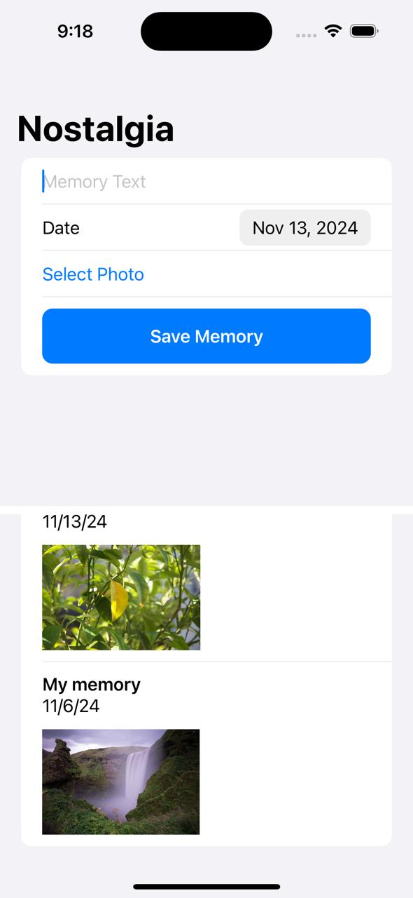
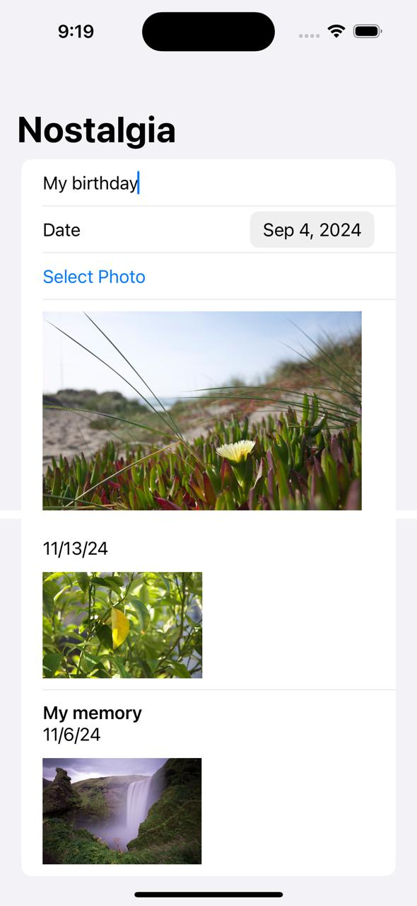
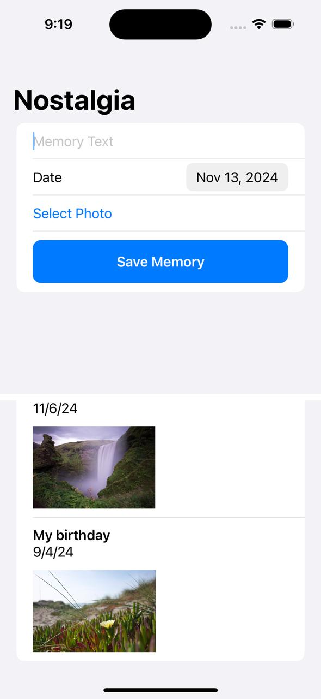

## Nostalgia is a simple iOS app built with Swift and SwiftUI. It offers the following features:
-- Save texts of memories
-- Save date and relevant photos
-- Watch previous memories
-- Get notifications about a memory every year on the same date 

